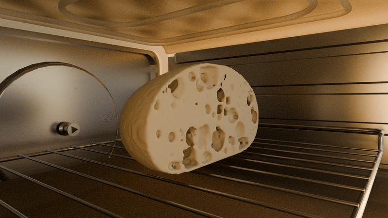

# Bread 🥖

**Team:** Live Laugh Loaf  
**Members:**
`Grace Marshburn` `Lana Yang-Maccini` `Sophie Zhang` `Tiffany Huang`

---

## Paper

We implemented [Procedural Bread Making](https://www.sciencedirect.com/science/article/pii/S0097849315000503) by
Rodrigo Baravalle, Gustavo Ariel Patow, and Claudio Delrieux

## Results

 _Visualization of bread baking (deforming and rising) over time._

## Slides

Link to [slides](https://docs.google.com/presentation/d/14CjRwywVD9sJbUnkicvNXF9Ry3lyDxicRIO2Aa5_eR0/edit?usp=sharing).
